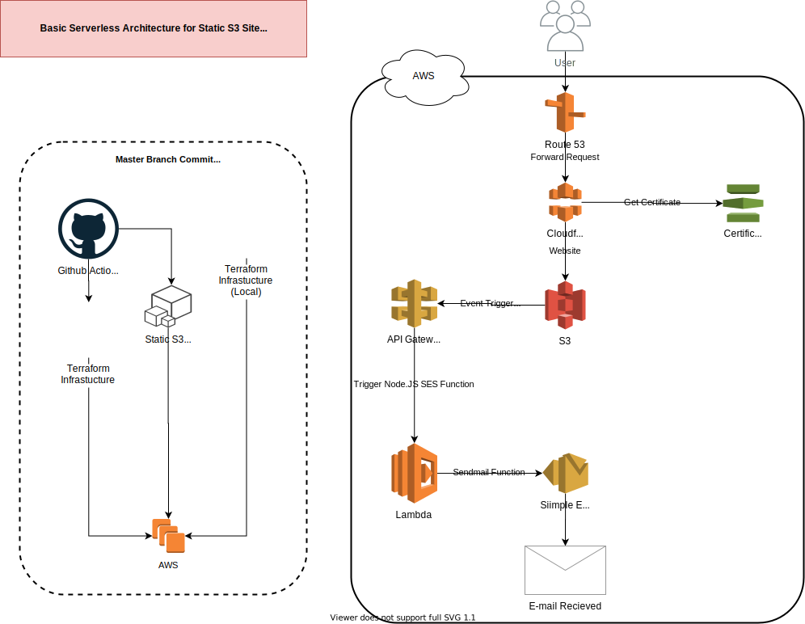

# tylerbailey.com (Basic Serverless Website)
This repo contains the website code (basic html), terraform infrastructure, and the Github Actions deployment pipeline for my resume site tylerbailey.com.



Website: -> `public` folder
- Basic static website which is hosted on S3.

Infrastructure: -> `infrastructure` folder
- Makes use of a serverless architecture build.
- Contains Terraform modules for S3, Cloudfront, ACM, Route53, SES, API Gatway, Lambda.

Pipeline: -> `.github/workflows` folder
- Terraform infrastructure is built/validated/deployed through Github Actions.
- The public folder which contains the website is copied to S3 followed by invalidating the Cloudfront cache through Github Actions.

## Requirements
- AWS CLI
- Terraform
- Github

## Website
Changes made under the `public` folder will run the pipeline to redeploy to s3 and clear the cache.

## Infrastructure
Create a IAM user for github to use for deploying Terraform (You can tweak the permissions on a resource basis)
### AWS IAM User
```
aws iam create-user --user-name github
aws iam create-access-key --user-name github
aws iam attach-user-policy --policy-arn arn:aws:iam::aws:policy/AdministratorAccess --user-name github
```

### Github Secrets
Setup the following secrets under your Github repos `settings/secrets`. You'll need to add your AWS access key, AWS secret key, Cloudfront distribution ID, S3 bucket name you selected for your site.
```
AWS_ACCESS_KEY_ID
AWS_SECRET_ACCESS_KEY
DISTRIBUTION_ID
AWS_S3_BUCKET
```

### Managed outside of terraform
- Dynamo DB Table (Managing Statelock)
- S3 Bucket (Terraform State storage)
- Route53 Zone (Shared with other services)
Replace your S3 bucket/dynamodb details under `infrastructure/env/production/remote-state.tf`

#### DynamoDB
Create a DynamoDB Table to manage Terraform state.
```
aws dynamodb create-table --table-name tylerbailey-terraform-state --attribute-definitions AttributeName=LockID,AttributeType=S --key-schema AttributeName=LockID,KeyType=HASH --provisioned-throughput ReadCapacityUnits=5,WriteCapacityUnits=5
```

#### S3 Bucket
Create a S3 bucket with proper versioning and security to house the Terraform state.
```
aws s3api create-bucket --bucket tylerbailey-terraform-state --acl private --region us-east-1
aws s3api put-bucket-versioning --bucket tylerbailey-terraform-state --versioning-configuration Status=Enabled
aws s3api put-public-access-block --bucket tylerbailey-terraform-state --public-access-block-configuration "BlockPublicAcls=true,IgnorePublicAcls=true,BlockPublicPolicy=true,RestrictPublicBuckets=true"
```

##### S3 Bucket Policy
Create a S3 Bucket policy to limit 
```
aws s3api put-bucket-policy --bucket tylerbaily-terraform-state --policy file://../../../infrastructure/policy.json
```
Modify the policy under `infrastructure/policy.json`
```
{
    "Version": "2008-10-17",
    "Statement": [
        {
            "Effect": "Allow",
            "Principal": {
                "AWS": "arn:aws:iam::REPLACEME:user/github"
            },
            "Action": "s3:*",
            "Resource": "arn:aws:s3:::tylerbailey-terraform-state"
        }
    ]
}
```

#### Terraform workspace
Ensure you the workspace you specify here is updated in `.github/terraform_plan.yml` and `.github/terraform_deploy.yml`.
```
terraform init
terraform workspace new production
terraform workspace select production
```